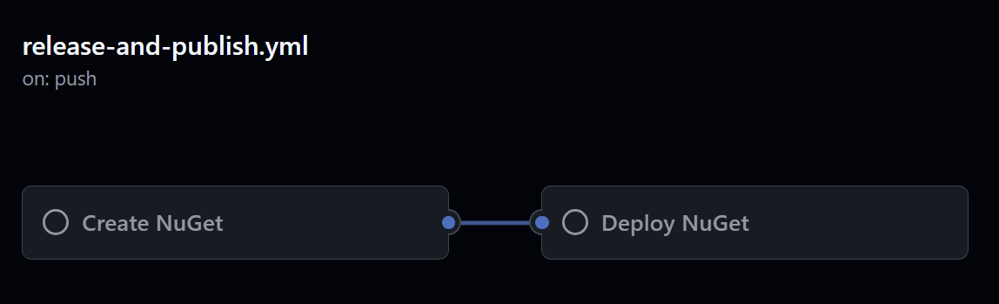
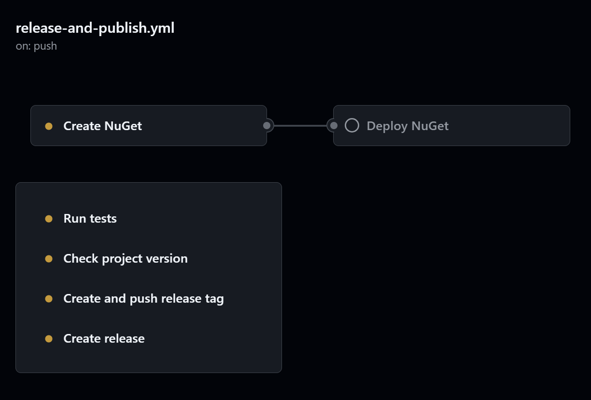
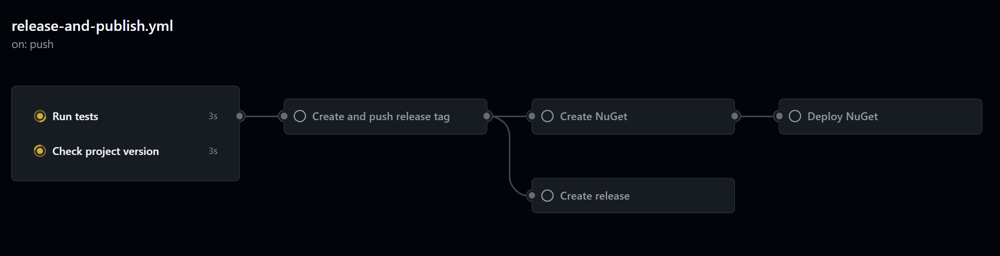
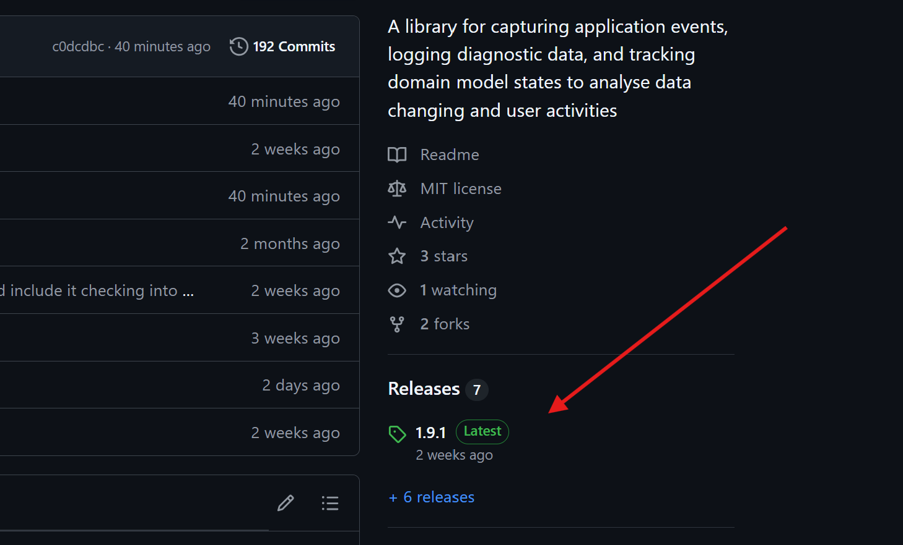
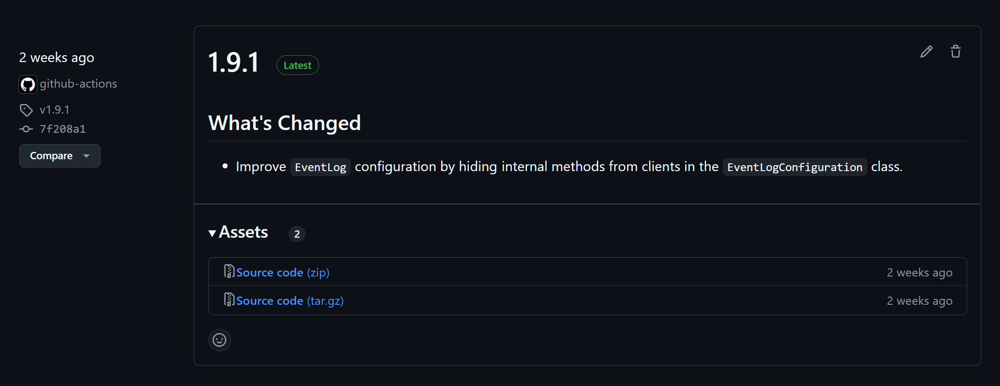

[EN: Automate NuGet package verification and deployment with GitHub Actions](EN.md)

# Автоматизация верификации и публикации NuGet пакета с помощью GitHub actions

В этой статье на практическом примере я хочу показать как настроить [CI/CD](https://github.com/resources/articles/devops/ci-cd) используя [GitHub actions](https://github.com/features/actions) для валидации и развертывания NuGet пакета, начиная с минимально полезного пайплайна и постепенного расширения функционала до полной автоматизации запланированных требований.

## Содержание
* [Окружение, процессы и постановка задачи](#%D0%BE%D0%BA%D1%80%D1%83%D0%B6%D0%B5%D0%BD%D0%B8%D0%B5-%D0%BF%D1%80%D0%BE%D1%86%D0%B5%D1%81%D1%81%D1%8B-%D0%B8-%D0%BF%D0%BE%D1%81%D1%82%D0%B0%D0%BD%D0%BE%D0%B2%D0%BA%D0%B0-%D0%B7%D0%B0%D0%B4%D0%B0%D1%87%D0%B8)
* [Первоначальная конфигурация](#%D0%BF%D0%B5%D1%80%D0%B2%D0%BE%D0%BD%D0%B0%D1%87%D0%B0%D0%BB%D1%8C%D0%BD%D0%B0%D1%8F-%D0%BA%D0%BE%D0%BD%D1%84%D0%B8%D0%B3%D1%83%D1%80%D0%B0%D1%86%D0%B8%D1%8F)
* [Необходимые этапы для публикации в ручном режиме](#%D0%BD%D0%B5%D0%BE%D0%B1%D1%85%D0%BE%D0%B4%D0%BC%D1%8B%D0%B5-%D1%8D%D1%82%D0%B0%D0%BF%D1%8B-%D0%B4%D0%BB%D1%8F-%D0%BF%D1%83%D0%B1%D0%BB%D0%B8%D0%BA%D0%B0%D1%86%D0%B8%D0%B8-%D0%B2-%D1%80%D1%83%D1%87%D0%BD%D0%BE%D0%BC-%D1%80%D0%B5%D0%B6%D0%B8%D0%BC%D0%B5)
* [Кратко о том, что такое автоматизация с помощью `GitHub actions` и о структуре `yaml` файла](#%D0%BA%D1%80%D0%B0%D1%82%D0%BA%D0%BE-%D0%BE-%D1%82%D0%BE%D0%BC-%D1%87%D1%82%D0%BE-%D1%82%D0%B0%D0%BA%D0%BE%D0%B5-%D0%B0%D0%B2%D1%82%D0%BE%D0%BC%D0%B0%D1%82%D0%B8%D0%B7%D0%B0%D1%86%D0%B8%D1%8F-%D1%81-%D0%BF%D0%BE%D0%BC%D0%BE%D1%89%D1%8C%D1%8E-github-actions-%D0%B8-%D0%BE-%D1%81%D1%82%D1%80%D1%83%D0%BA%D1%82%D1%83%D1%80%D0%B5-yaml-%D1%84%D0%B0%D0%B9%D0%BB%D0%B0)
* [1. MVP пайплайн](#1-mvp-%D0%BF%D0%B0%D0%B9%D0%BF%D0%BB%D0%B0%D0%B9%D0%BD)
   * [1.1. Создание пайплайна с триггером запуска](#11-%D1%81%D0%BE%D0%B7%D0%B4%D0%B0%D0%BD%D0%B8%D0%B5-%D0%BF%D0%B0%D0%B9%D0%BF%D0%BB%D0%B0%D0%B9%D0%BD%D0%B0-%D1%81-%D1%82%D1%80%D0%B8%D0%B3%D0%B3%D0%B5%D1%80%D0%BE%D0%BC-%D0%B7%D0%B0%D0%BF%D1%83%D1%81%D0%BA%D0%B0)
   * [1.2. Добавление джобы сборки пакета](#12-%D0%B4%D0%BE%D0%B1%D0%B0%D0%B2%D0%BB%D0%B5%D0%BD%D0%B8%D0%B5-%D0%B4%D0%B6%D0%BE%D0%B1%D1%8B-%D1%81%D0%B1%D0%BE%D1%80%D0%BA%D0%B8-%D0%BF%D0%B0%D0%BA%D0%B5%D1%82%D0%B0)
   * [1.3. Добавление джобы публикации пакета](#13-%D0%B4%D0%BE%D0%B1%D0%B0%D0%B2%D0%BB%D0%B5%D0%BD%D0%B8%D0%B5-%D0%B4%D0%B6%D0%BE%D0%B1%D1%8B-%D0%BF%D1%83%D0%B1%D0%BB%D0%B8%D0%BA%D0%B0%D1%86%D0%B8%D0%B8-%D0%BF%D0%B0%D0%BA%D0%B5%D1%82%D0%B0)
   * [1.4. Результат](#14-%D1%80%D0%B5%D0%B7%D1%83%D0%BB%D1%8C%D1%82%D0%B0%D1%82)
* [2. Добавление проверки прохождения тестов](#2-%D0%B4%D0%BE%D0%B1%D0%B0%D0%B2%D0%BB%D0%B5%D0%BD%D0%B8%D0%B5-%D0%BF%D1%80%D0%BE%D0%B2%D0%B5%D1%80%D0%BA%D0%B8-%D0%BF%D1%80%D0%BE%D1%85%D0%BE%D0%B6%D0%B4%D0%B5%D0%BD%D0%B8%D1%8F-%D1%82%D0%B5%D1%81%D1%82%D0%BE%D0%B2)
* [3. Добавление проверки текущей версии проекта](#3-%D0%B4%D0%BE%D0%B1%D0%B0%D0%B2%D0%BB%D0%B5%D0%BD%D0%B8%D0%B5-%D0%BF%D1%80%D0%BE%D0%B2%D0%B5%D1%80%D0%BA%D0%B8-%D1%82%D0%B5%D0%BA%D1%83%D1%89%D0%B5%D0%B9-%D0%B2%D0%B5%D1%80%D1%81%D0%B8%D0%B8-%D0%BF%D1%80%D0%BE%D0%B5%D0%BA%D1%82%D0%B0)
* [4. Добавление тега с версией на текущий релизный комит](#4-%D0%B4%D0%BE%D0%B1%D0%B0%D0%B2%D0%BB%D0%B5%D0%BD%D0%B8%D0%B5-%D1%82%D0%B5%D0%B3%D0%B0-%D1%81-%D0%B2%D0%B5%D1%80%D1%81%D0%B8%D0%B5%D0%B9-%D0%BD%D0%B0-%D1%82%D0%B5%D0%BA%D1%83%D1%89%D0%B8%D0%B9-%D1%80%D0%B5%D0%BB%D0%B8%D0%B7%D0%BD%D1%8B%D0%B9-%D0%BA%D0%BE%D0%BC%D0%B8%D1%82)
* [5. Создание релиза в репозитории GitHub](#5-%D1%81%D0%BE%D0%B7%D0%B4%D0%B0%D0%BD%D0%B8%D0%B5-%D1%80%D0%B5%D0%BB%D0%B8%D0%B7%D0%B0-%D0%B2-%D1%80%D0%B5%D0%BF%D0%BE%D0%B7%D0%B8%D1%82%D0%BE%D1%80%D0%B8%D0%B8-github)
* [6. Управление зависимостями между джобами и очередностью выполнения](#6-%D1%83%D0%BF%D1%80%D0%B0%D0%B2%D0%BB%D0%B5%D0%BD%D0%B8%D0%B5-%D0%B7%D0%B0%D0%B2%D0%B8%D1%81%D0%B8%D0%BC%D0%BE%D1%81%D1%82%D1%8F%D0%BC%D0%B8-%D0%BC%D0%B5%D0%B6%D0%B4%D1%83-%D0%B4%D0%B6%D0%BE%D0%B1%D0%B0%D0%BC%D0%B8-%D0%B8-%D0%BE%D1%87%D0%B5%D1%80%D0%B5%D0%B4%D0%BD%D0%BE%D1%81%D1%82%D1%8C%D1%8E-%D0%B2%D1%8B%D0%BF%D0%BE%D0%BB%D0%BD%D0%B5%D0%BD%D0%B8%D1%8F)
* [7. Финальный пайплан](#7-%D1%84%D0%B8%D0%BD%D0%B0%D0%BB%D1%8C%D0%BD%D1%8B%D0%B9-%D0%BF%D0%B0%D0%B9%D0%BF%D0%BB%D0%B0%D0%BD)
* [Заключение](#%D0%B7%D0%B0%D0%BA%D0%BB%D1%8E%D1%87%D0%B5%D0%BD%D0%B8%D0%B5)

## Окружение, процессы и постановка задачи

Предположим, мы разрабатываем библиотеку, используя стек `C#/.NET` и планируем её в дальнейшем разместить в общий доступ в виде `NuGet` пакета.
На данном этапе имеем `.NET` решение (solution) в локальном `Git` репозитории. В качестве удаленного репозитория используется `GitHub` сервис.

Разберем этапы ручной публикации (deploy) пакета, чтобы понимать те процессы, которые в последствии будем автоматизировать.
Всю работу можно условно разделить на две части. Первая часть - это предварительная конфигурация окружения и проекта, вторая - непосредственно ручная рутина для каждой публикации ньюгета.

### Первоначальная конфигурация

1. В качестве хоста `NuGet` пакетов будем использовать [nuget.org](https://www.nuget.org) сервис. Для этого [создадим аккаунт](https://learn.microsoft.com/en-us/nuget/nuget-org/individual-accounts#add-a-new-individual-account), если его еще нет
2. [Генерируем в аккаунте API ключ](https://learn.microsoft.com/en-us/nuget/nuget-org/publish-a-package#create-an-api-key), который нам будет необходим для последующей публикации ньюгета
3. Добавим необходимые [метаданные](https://learn.microsoft.com/en-us/nuget/create-packages/package-authoring-best-practices) в `<PropertyGroup>` и `<ItemGroup>` конфигурационного файла проекта (`*.csproj`) для публикации

```xml
<PropertyGroup>

  <!-- Уникальный индентификатор NuGet пакета и версия -->
  <PackageId>Library.UsefulPackage</PackageId>
  <Version>1.0.1</Version>

  <!-- Информация о лицензии -->
  <PackageLicenseExpression>MIT</PackageLicenseExpression>

  <!-- Авторство, описание проекта, логотип, документация -->
  <Authors>Software Developer</Authors>
  <Title>Краткое описание пакета</Title>
  <Description>Развернутое описание пакета</Description>
  <PackageIcon>logo.png</PackageIcon>
  <PackageReadmeFile>README.md</PackageReadmeFile>
  <GenerateDocumentationFile>True</GenerateDocumentationFile>

  <!-- Ссылка на репозиторий с исходным кодом -->
  <RepositoryUrl>https://github.com/software-developer/useful-library</RepositoryUrl>

  <!-- Теги описывающие проект для индексации и поиска -->
  <PackageTags>dotnet, useful, lib, etc</PackageTags>
</PropertyGroup>

<ItemGroup>

   <!-- Добавление необходмых ссылок для ProprtyGroup элементов -->
   <None Include="..\..\images\logo.png" Pack="true" PackagePath="\"/>
   <None Include="..\..\LICENSE" Pack="true" PackagePath="LICENSE"/>
   <None Include="..\..\README.md" Pack="true" PackagePath="\"/>

</ItemGroup>
```

### Необходимые этапы для публикации в ручном режиме

Когда готов выпуск новой версии, необходимо каждый раз выполнять перечисленные ниже шаги для доставки новой версии ньюгета пользователем.

1. Запуск юнит тестов
2. Инкрементация [версии](https://learn.microsoft.com/en-us/nuget/create-packages/package-authoring-best-practices#package-version) в проектном конфигурацинном файле: `<Version>1.0.1</Version>`
3. Слияние комитов в мастер ветку и добавление `Git` тега с релизной версией на комит
4. Сборка релизной версии библиотеки: `dotnet pack --configuration Release`
5. Публикации релизной версию на `nuget.org` для общего доступа: `dotnet nuget push {NUGET_NAME_WITH_VERSION} --api-key {API_KEY} --source https://api.nuget.org/v3/index.json`
6. Создание [релиза](https://docs.github.com/en/repositories/releasing-projects-on-github/about-releases) в `GitHub` репозитории с описанием изменений в текущей версии для пользователей 

Возьмем эти пункты в качестве требований и автоматизируем процесс.

## Кратко о том, что такое автоматизация с помощью `GitHub actions` и о структуре `yaml` файла

[GitHub actions](https://github.com/features/actions) это инструменты [CI/CD](https://github.com/resources/articles/devops/ci-cd) для автоматизации рабочих процессов при создании и публикации программного обеспечения. Под рабочими процессами подразумевается управление ветками разработчиков в процессе создания пулриквестов, код ревью и слияния, а так же сборки, тестирования и публикации результата.

Довольно множество дейтсвий в процессе публикации можно рассматривать как повторяющиеся и рутинные, которые можно автоматизировать и при необходимости добавлять гибкость с помощью параметров или условных конструкций. Другими словами, автоматизировать процесс путем написание скрипта в `yaml` файле, который будет интерпретироваться `GitHub` сервисом как набор инструкций автоматизации.

`Yaml` файл включает в себя следующие инструкции:
1. Триггеры запуска автоматизации (к прмиеру, комит в определенную ветку, пул риквест)
2. Окружение в котором будут выполнятся команды (тип и версия ОС, контейнер)
3. Описание исполняемых команд. Команды рассматриваются как `steps` в контексте одной `job`. `Pipeline` может содержать несколько `jobs`

Более подробно о том, что из себя представляют `GitHub Actions` можно почитать на [официальном сайте](https://docs.github.com/en/actions/about-github-actions/understanding-github-actions).

Документацию по написанию рабочих процессов можно найти [здесь](https://docs.github.com/en/actions/writing-workflows).

## 1. MVP пайплайн

### 1.1. Создание пайплайна с триггером запуска

Добавим в репозиторий проекта файл `./github/workflows/release-and-publish.yml` с указанием имени пайплайна и [события, по которому он будет запускаться](https://docs.github.com/en/actions/writing-workflows/choosing-when-your-workflow-runs/events-that-trigger-workflows). В нашем случае это комит на мастер ветку удаленного репозитория.

```yaml
# 1.1. Создание пайплайна с триггером запуска
# Имя пайплайна
name: Create release and publish NuGet

# Условия при котором пайплайн будет запускаться. В данном случае это комит в удаленную ветку master
on:
  push:
    branches:
      - "master"

# Сюда будут добавлены джобы в соответствии с требованиями
jobs:
```

Для создания минимально работающей и полезной версии пайплайна добавим джобу сборки ньюгет пакета и джобу публикации артифакта на хосте nuget.org.

### 1.2. Добавление джобы сборки пакета

Здесь и далее буду показывать только дельту изменения пайплайна. Финальную версию можно найти в [конце статьи](https://github.com/cat-begemot/article-pipeline-for-nuget/tree/main?tab=readme-ov-file#7-%D1%84%D0%B8%D0%BD%D0%B0%D0%BB%D1%8C%D0%BD%D1%8B%D0%B9-%D0%BF%D0%B0%D0%B9%D0%BF%D0%BB%D0%B0%D0%BD).

```yaml
# 1.2. Добавления джобы сборки пакета
# Уникальный референс индентификатор джобы
create_nuget:
  # Юзер френдли имя джобы, которое будет отображаться на UI
  name: Create NuGet
  # Среда исполения. Каждая джоба выполняется изолировано в своей среде
  runs-on: ubuntu-24.04
  # Save path to the NuGet directory in the environment variable
  env:
    NuGetDirectory: ${{ github.workspace}}/nuget
  # Перечень последовательно запускаемых команд
  steps:
    # Чекаут на комит ветки для доступа к исходному коду
    - name: Checkout repository
      uses: actions/checkout@v4

    # Установка SDK
    - name: Setup .NET
      uses: actions/setup-dotnet@v4

    # Сборка и упаковка пакета
    - name: Pack
      shell: pwsh
      run: dotnet pack .\src\UsefulPackage --configuration Release --output ${{ env.NuGetDirectory }}

    # Загрузка артефакта в хранилище для доступа к нему из других джоб
    - uses: actions/upload-artifact@v4
      with:
        name: nuget
        if-no-files-found: error
        retention-days: 7
        path: ${{ env.NuGetDirectory }}/*.nupkg
```

Как результат имеем загруженный в хранилище собранный артефакт с именем UsefulPackage.1.0.1.nupkg, где версия пакета - это версия, прописанная в csproj файле проекта. Необходимо не забывать инкрементировать соответствующую часть версии с каждым релизом, так как одну и ту же версию не получится опубликовать на nuget.org дважды.

### 1.3. Добавление джобы публикации пакета

```yaml
# 1.3. Добавления джобы публикации пакета
deploy:
  name: Deploy NuGet
  runs-on: ubuntu-24.04
  # Перед публикацией необходим готовый артефакт.
  # Поэтому эта джоба ждет завершения выполнения джобы create_nuget
  needs: create_nuget
  # Выполнить, если успешно завершилось выполнение create_nuget
  if: success()
  # Save path to the NuGet directory in the environment variable
  env:
    NuGetDirectory: ${{ github.workspace}}/nuget
  steps:
    # Загружаем содержимое хранилища
    - name: Download artifact
      uses: actions/download-artifact@v4
      with:
        name: nuget
        path: ${{ env.NuGetDirectory }}

    - name: Setup .NET Core
      uses: actions/setup-dotnet@v4

    # С помощью dotnet утилиты nuget публикуе пакет
    - name: Publish NuGet package
      shell: pwsh
      run: |
        foreach($file in (Get-ChildItem "${{ env.NuGetDirectory }}" -Recurse -Include *.nupkg)) {
            dotnet nuget push $file --api-key "${{ secrets.NUGET_APIKEY }}" --source https://api.nuget.org/v3/index.json --skip-duplicate
        }
```

Итерируем содержимое загруженного хранилища включая поддиректории и загружаем каждый найденный файл с расширением `*.nupkg` на `nuget.org`. Чтобы не хранить ключ доступа к хосту ньюгетов в открытом доступе, [сохраняем его приватно в настройках репозитория](https://docs.github.com/en/actions/security-for-github-actions/security-guides/using-secrets-in-github-actions) и ссылаемся на него из пайплайна.

### 1.4. Результат

По итогу имеем минимально функционирующий пайплайн, не смотря на то, что к нему есть довольно много вопросов.



В последующих разделах мы расширим текущих функционал с целью нивелировать следующие вопросы:
- Целесообразность выполнения, если тесты не пройдены успешно
- Защита от не измененной или не правильно измененной версии проекта
- Добавление тега на комит релиза
- Создание GitHub релиза

## 2. Добавление проверки прохождения тестов

Чтобы быть уверенным в том, что к публикации не допускается код, тесты которого не выполнены успешно, добавим соответствующую джобу. 

```yaml
# 2. Добавление проверки прохождения тестов
run_test:
  name: Run tests
  runs-on: ubuntu-24.04
  steps:
    - name: Checkout repository
      uses: actions/checkout@v4

    - name: Setup .NET
      uses: actions/setup-dotnet@v4

    - name: Run tests
      shell: pwsh
      run: dotnet test --configuration Release .\src\UsefulPackage.UnitTests
```

## 3. Добавление проверки текущей версии проекта

На этом этапе мы хотим убедиться, что версия проекта, указанная в `csproj` файле проекта выше последней версии, которую мы извлечем из тега последнего релизного комита. Другими словами, что мы не забыли повысить версию проекта перед пушем кода в `master` ветку удаленного репозитория.

```yaml
# 3. Добавление проверки текущей версии проекта
check_version:
  name: Check project version
  runs-on: ubuntu-24.04
  outputs:
    # Возвращает результат проверки в переменной is_valid
    is_valid: ${{ steps.compare_versions.outputs.is_valid }}
  steps:
    - name: Checkout repository
      uses: actions/checkout@v4

    - name: Get project version from .csproj
      shell: bash
      run: |
        # Получаем версию проекта из csproj файла
        VERSION=$(grep -oPm1 "(?<=<Version>)[^<]+" ./src/UsefulPackage/UsefulPackage.csproj)
        echo "Project version is $VERSION"
        # Сохраняем результат в переменную VERSION
        echo "VERSION=$VERSION" >> $GITHUB_ENV

    - name: Get latest tag
      id: tag
      run: |
        # Получаем последнюю релизную версию по git тегу из лога репозитория
        git fetch --tags
        LATEST_TAG=$(git tag -l "v*" --sort=-v:refname | head -n 1)
        echo "Latest tag: $LATEST_TAG"
        # Сохраняем результат в переменную LATEST_TAG
        echo "LATEST_TAG=$LATEST_TAG" >> $GITHUB_ENV

    - name: Compare Strings
      id: compare_versions
      run: |
        # Находим максимальную вверсию сравнивая VERSION и LATEST_TAG и сохраняем ее в переменную GREATER_VERSION
        GREATER_VERSION=$(printf "%s\n%s" "$VERSION" "${LATEST_TAG#v}" | sort -V | tail -n 1)
        if [[ "$VERSION" == "$GREATER_VERSION" && "$VERSION" != "${LATEST_TAG#v}" ]]; then
          # Если версия в конфигурацинном файле проекта выше версии тега, то проверка пройдена
          echo "The new release version is ${LATEST_TAG#v}"
          echo "is_valid=true" >> $GITHUB_OUTPUT
        else
          # Иначе сигнализируем об ошибке
          echo "The project version is not incremented"
          echo "is_valid=false" >> $GITHUB_OUTPUT
        fi
```

## 4. Добавление тега с версией на текущий релизный комит

Как минимум иметь git тег с версией релиза нам удобно по 3 причинам:
- В гит логах быстро находить и переключаться на комит соответствующей версии релиза
- На этот тег завязана проверка текущей версии проекта из предыдущего шага
- GitHub Release (релиз ноут секция) функционал завязан на соответствующий тег

```yaml
# 4. Добавление тега с версией на текущий релизный комит
tag_and_push:
  name: Create and push release tag
  runs-on: ubuntu-24.04
  steps:
    - name: Checkout repository
      uses: actions/checkout@v4

    # Наконфигурируем в настроцках Git текущей джобы имя и адрес почты автора для тега
    - name: Set up Git
      run: |
        git config --global user.name "${{ secrets.GIT_USER_NAME }}"
        git config --global user.email "${{ secrets.GIT_USER_EMAIL }}"

    # Используя второй раз один и тот же код, неплохо его было бы вынести в отдельный action
    # Для упрощения, оставим дубляж как есть
    - name: Get project version from .csproj
      shell: bash
      run: |
        VERSION=$(grep -oPm1 "(?<=<Version>)[^<]+" ./src/UsefulPackage/UsefulPackage.csproj)
        echo "Project version is $VERSION"
        echo "VERSION=$VERSION" >> $GITHUB_ENV

    - name: Fetch the latest changes from the remote repository
      run: |
        git fetch --tags

    - name: Create and push tag
      run: |
        NEW_TAG="v$VERSION"
        git tag $NEW_TAG
        echo "Tag created: $NEW_TAG"
        git push origin $NEW_TAG 
```

## 5. Создание релиза в репозитории GitHub

Желательно, чтобы у пользователей был доступ к [документации релизной версии продукта](https://docs.github.com/en/repositories/releasing-projects-on-github/about-releases) с информацией о соответвующих изменениях.

```yaml
# 5. Создание релиза в репозитории GitHub
release:
  name: Create release
  runs-on: ubuntu-24.04
  steps:
    - name: Checkout repository
      uses: actions/checkout@v4

    - name: Create GitHub release
      run: |
        git fetch --tags
        NEW_TAG=$(git describe --tags --abbrev=0 origin/master)
        echo "Latest tag on master: $NEW_TAG"
        gh release create $NEW_TAG \
            --repo="$GITHUB_REPOSITORY" \
            --title="${NEW_TAG#v}" \
            --generate-notes \
            --generate-notes \
            --verify-tag \
            --latest
```

## 6. Управление зависимостями между джобами и очередностью выполнения

В результате автоматизации всех требований мы получили цепочку выполняющихся действий.



Но проблема в том, что джобы выполняются в не зависимости от успешности/не успешности выполнения других джоб, хотя у нас есть явные зависимости и четкая последовательность. К примеру, не имеет смысла выполнять весь воркфлоу, если тесты не пройдены или версия проекта установлена не правильно.

Для управления зависимостями и условиями, используются в джобах теги `needs` и `if`, внутри которых можно использовать ссылки на другие джобы или переменные по их уникальным идентификаторам.

```yaml
    # Джоба ожидает выполнения указанных в условии других джоб
    needs: [run_test, check_version]
    # Создаем  тег после того, как убедились, что юнит тесты пройдены и проверка версии завершена успешно
    if: ${{ success() && needs.check_version.outputs.is_valid == 'true' }}
```

По итогу правильно выстроенные зависимости и последовательность исполнения джоб будет выглядеть следующим образом:



Проследить как я этого добился можно по вышеупомянутым тегам в финальном `yaml` файле.

## 7. Финальный пайплан

```yaml
# 1.1. Создание пайплайна с триггером запуска
# Pipeline name
name: Create release and publish NuGet

# Trigger when a commit is created on the remote master branch
on:
  push:
    branches:
      - "test"

jobs:
  # 2. Добавление проверки прохождения тестов
  run_test:
    name: Run tests
    runs-on: ubuntu-24.04
    steps:
      - name: Checkout repository
        uses: actions/checkout@v4

      - name: Setup .NET
        uses: actions/setup-dotnet@v4

      - name: Run tests
        shell: pwsh
        run: dotnet test --configuration Release .\src\UsefulPackage.UnitTests
  
  # 3. Добавление проверки текущей версии проекта
  check_version:
    name: Check project version
    runs-on: ubuntu-24.04
    outputs:
      # Возвращает результат проверки в переменной is_valid
      is_valid: ${{ steps.compare_versions.outputs.is_valid }}
    steps:
      - name: Checkout repository
        uses: actions/checkout@v4

      - name: Get project version from .csproj
        shell: bash
        run: |
          # Получаем версию проекта из csproj файла
          VERSION=$(grep -oPm1 "(?<=<Version>)[^<]+" ./src/UsefulPackage/UsefulPackage.csproj)
          echo "Project version is $VERSION"
          # Сохраняем результат в переменную VERSION
          echo "VERSION=$VERSION" >> $GITHUB_ENV

      - name: Get latest tag
        id: tag
        run: |
          # Получаем последнюю релизную версию по git тегу из лога репозитория
          git fetch --tags
          LATEST_TAG=$(git tag -l "v*" --sort=-v:refname | head -n 1)
          echo "Latest tag: $LATEST_TAG"
          # Сохраняем результат в переменную LATEST_TAG
          echo "LATEST_TAG=$LATEST_TAG" >> $GITHUB_ENV

      - name: Compare Strings
        id: compare_versions
        run: |
          # Находим максимальную вверсию сравнивая VERSION и LATEST_TAG и сохраняем ее в переменную GREATER_VERSION
          GREATER_VERSION=$(printf "%s\n%s" "$VERSION" "${LATEST_TAG#v}" | sort -V | tail -n 1)
          if [[ "$VERSION" == "$GREATER_VERSION" && "$VERSION" != "${LATEST_TAG#v}" ]]; then
            # Если версия в конфигурацинном файле проекта выше версии тега, то проверка пройдена
            echo "The new release version is ${LATEST_TAG#v}"
            echo "is_valid=true" >> $GITHUB_OUTPUT
          else
            # Иначе сигнализируем об ошибке
            echo "The project version is not incremented"
            echo "is_valid=false" >> $GITHUB_OUTPUT
          fi

  # 4. Добавление тега с версией на текущий релизный комит
  tag_and_push:
    name: Create and push release tag
    runs-on: ubuntu-24.04
    # Джоба ожидает выполнения указанных в условии других джоб
    needs: [run_test, check_version]
    # Создаем  тег после того, как убедились, что юнит тесты пройдены и проверка версии завершена успешно
    if: ${{ success() && needs.check_version.outputs.is_valid == 'true' }}
    steps:
      - name: Checkout repository
        uses: actions/checkout@v4

      # Наконфигурируем в настроцках Git текущей джобы имя и адрес почты автора для тега
      - name: Set up Git
        run: |
          git config --global user.name "${{ secrets.GIT_USER_NAME }}"
          git config --global user.email "${{ secrets.GIT_USER_EMAIL }}"

      # Используя второй раз один и тот же код, неплохо его было бы вынести в отдельный action
      # Для упрощения, оставим дубляж как есть
      - name: Get project version from .csproj
        shell: bash
        run: |
          VERSION=$(grep -oPm1 "(?<=<Version>)[^<]+" ./src/UsefulPackage/UsefulPackage.csproj)
          echo "Project version is $VERSION"
          echo "VERSION=$VERSION" >> $GITHUB_ENV

      - name: Fetch the latest changes from the remote repository
        run: |
          git fetch --tags

      - name: Create and push tag
        run: |
          NEW_TAG="v$VERSION"
          git tag $NEW_TAG
          echo "Tag created: $NEW_TAG"
          git push origin $NEW_TAG

  # 5. Создание релиза в репозитории GitHub
  release:
    name: Create release
    runs-on: ubuntu-24.04
    needs: tag_and_push
    if: success()
    steps:
      - name: Checkout repository
        uses: actions/checkout@v4

      - name: Create GitHub release
        run: |
          git fetch --tags
          NEW_TAG=$(git describe --tags --abbrev=0 origin/master)
          echo "Latest tag on master: $NEW_TAG"
          gh release create $NEW_TAG \
              --repo="$GITHUB_REPOSITORY" \
              --title="${NEW_TAG#v}" \
              --generate-notes \
              --generate-notes \
              --verify-tag \
              --latest

  1.2. Добавления джобы сборки пакета
  # Уникальный референс индентификатор джобы
  create_nuget:
    # Юзер френдли имя джобы, которое будет отображаться на UI
    name: Create NuGet
    # Среда исполения. Каждая джоба выполняется изолировано в своей среде
    runs-on: ubuntu-24.04
    # Save path to the NuGet directory in the environment variable
    needs: tag_and_push
    if: success()
    env:
      NuGetDirectory: ${{ github.workspace}}/nuget
    # Перечень последовательно запускаемых команд
    steps:
      # Чекаут на комит ветки для доступа к исходному коду
      - name: Checkout repository
        uses: actions/checkout@v4

      # Установка SDK
      - name: Setup .NET
        uses: actions/setup-dotnet@v4

      # Сборка и упаковка пакета
      - name: Pack
        shell: pwsh
        run: dotnet pack .\src\UsefulPackage --configuration Release --output ${{ env.NuGetDirectory }}

      # Загрузка артефакта в хранилище для доступа к нему из других джоб
      - uses: actions/upload-artifact@v4
        with:
          name: nuget
          if-no-files-found: error
          retention-days: 7
          path: ${{ env.NuGetDirectory }}/*.nupkg

  # 1.3. Добавления джобы публикации пакета
  deploy:
    name: Deploy NuGet
    runs-on: ubuntu-24.04
    # Перед публикацией необходим готовый артефакт.
    # Поэтому эта джоба ждет завершения выполнения джобы create_nuget
    needs: create_nuget
    # Выполнить, если успешно завершилось выполнение create_nuget
    if: success()
    # Save path to the NuGet directory in the environment variable
    env:
      NuGetDirectory: ${{ github.workspace}}/nuget
    steps:
      # Загружаем содержимое хранилища
      - name: Download artifact
        uses: actions/download-artifact@v4
        with:
          name: nuget
          path: ${{ env.NuGetDirectory }}

      - name: Setup .NET Core
        uses: actions/setup-dotnet@v4

      # С помощью dotnet утилиты nuget публикуе пакет
      - name: Publish NuGet package
        shell: pwsh
        run: |
          foreach($file in (Get-ChildItem "${{ env.NuGetDirectory }}" -Recurse -Include *.nupkg)) {
              dotnet nuget push $file --api-key "${{ secrets.NUGET_APIKEY }}" --source https://api.nuget.org/v3/index.json --skip-duplicate
          }
```

## Заключение

В этой статье я показал свой опыт написания пайплайна для GitHub Actions автоматизирая рутинные действия по публикации NuGet проекта, что позволяет больше фокусироваться на функционале, не производя каждый раз единообразные манипуляции по публикации релизов.

Слияние нового функционала с проставленной версией в мастер ветку приводит к автоматизированным этапам проверки и публикации NuGet пакета на nuget.org, что делает его через короткое время доступным для скачивания через NuGetPackage Manager или любой другой клиент NuGet пакетов.

Так же после выполнения пайплайна не стоит забывать обновить соответствующую секцию релиза в GitHub профилe.

 
